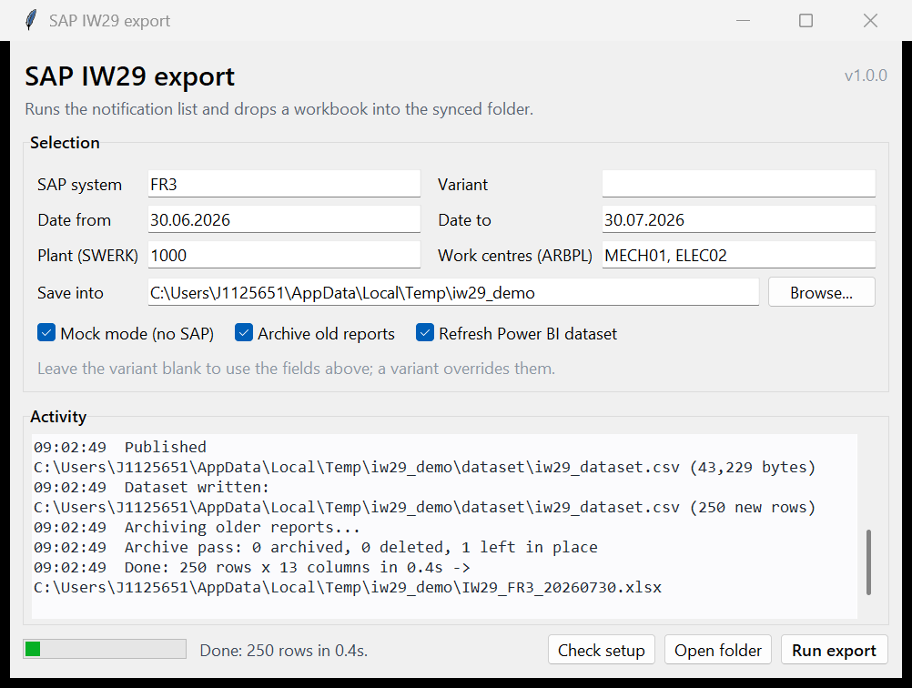

# SAP IW29 export

A small Windows app that runs SAP transaction **IW29**, exports the result list,
and drops a clean `.xlsx` into a OneDrive-synced SharePoint folder. It has a
one-window desktop UI for ad-hoc runs and a CLI for Task Scheduler.



## What it does

1. Attaches to a running SAP GUI, or starts SAP Logon and waits for its
   scripting engine to appear.
2. Opens IW29, applies a saved variant and/or your selection criteria, executes.
3. Exports the ALV result list to a local staging folder.
4. Builds a typed workbook: real dates, real numbers, styled header, frozen
   header row, autofilter.
5. Moves the finished file into the synced folder, so OneDrive never uploads a
   half-written report.
6. Refreshes a flat CSV for Power BI, files away reports older than N days, and
   deletes archived ones past your retention period.

## Requirements

- Windows, Python 3.9 or newer (tested on 3.11).
- SAP GUI for Windows with scripting enabled:
  `SAP Logon > Options > Accessibility & Scripting > Scripting > Enable scripting`.
  Untick **both** notification options. This matters more than it sounds: with
  them on, SAP puts up a confirmation popup that blocks the COM call until
  somebody clicks it, so an unattended run does not fail — it hangs forever.
- `sap.connection_name` in the config must be the SAP Logon entry *description*,
  not the three letter system id. The id is enough to reuse a session you already
  have open, but opening a new one needs the full name, e.g.
  `05 - Africa - Angola - FR3 - Unisup Ecc6 Production`. If your connection list
  is served centrally, the names live in the landscape XML referenced by
  `HKCU:\Software\SAP\SAPLogon\Options\LandscapeFileOnServer`.
- Server-side: profile parameter `sapgui/user_scripting = TRUE`. Your Basis team
  sets this; the app tells you clearly if it is off.
- `pip install -r requirements.txt` — that is `pywin32` only. The workbook writer
  uses the standard library, so there is no Excel or `openpyxl` dependency.
  `requirements-optional.txt` covers the two optional features.

## How to launch it

**The desktop app.** Double-click `launch_app.cmd` in the project folder. It
sets up the import path, opens the window, and only leaves a console behind if
something fails. For a Desktop icon instead:

```powershell
powershell -ExecutionPolicy Bypass -File .\scripts\create_shortcut.ps1
```

That puts "SAP IW29 export" on your Desktop, running through `pythonw.exe` so no
console appears at all. `-Remove` deletes it again.

Nothing happens to SAP until you press **Run export**, so it is safe to open and
look around. Tick **Mock mode** to rehearse the whole flow against generated
data.

**From a terminal**, in the project folder:

```powershell
$env:PYTHONPATH = "$PWD\src"            # once per terminal session
python -m iw29_export check             # pre-flight, touches nothing
python -m iw29_export --mock            # full run against generated data
python -m iw29_export run               # the real thing
python -m iw29_export gui               # same window as launch_app.cmd
```

`scripts\run_export.cmd` sets `PYTHONPATH` itself, so
`.\scripts\run_export.cmd run --days 7` works from anywhere. `pip install -e .`
also removes the need for `PYTHONPATH` and gives you an `iw29-export` command.

### First-time setup

```powershell
pip install -r requirements.txt
copy config.example.toml config.toml   # then edit it
python -m iw29_export check
```

Watch the first real run. SAP GUI is visible while it works, and if a screen id
does not match, the log names the element so you can correct it.

## Commands

| Command | What it does |
| --- | --- |
| `run` (default) | Export the report |
| `check` | Verify SAP, folders, credentials and selection without running anything |
| `archive` | Housekeeping only; add `--dry-run` to see what would move |
| `gui` | Open the desktop app |
| `store-password` / `forget-password` | Manage the SAP password in Windows Credential Manager |

Useful flags: `--mock`, `--days 7`, `--date-from 2026-07-01`, `--out <folder>`,
`--variant ZDAILY`, `--no-archive`, `--no-dataset`, `-q`.

Exit codes are meaningful, which matters for Task Scheduler: `0` success,
`2` configuration or pre-flight failure, `3`–`6` SAP problems, `7` export
problem, `8` ran fine but nothing matched, `9` another run holds the lock.

## Configuration

Everything lives in `config.toml` (see `config.example.toml` for the annotated
version). The parts worth understanding:

**Use a variant.** Set `selection.variant` to a saved IW29 selection variant.
SAP then owns the criteria and no screen field id can drift underneath the
script. Filters in the config are applied on top of the variant.

**Filters are data, not code.** Each `[[selection.filters]]` names an ABAP
select-option and its values. One value goes straight into the `-LOW` field;
several are loaded through the multiple-selection dialog via the clipboard,
which is far more robust than typing row by row.

```toml
[[selection.filters]]
field = "ARBPL"
values = ["MECH01", "ELEC02"]
```

**Export mode.** `text_then_convert` (default) has SAP write tab-delimited text
and builds the workbook here. `native_xlsx` drives SAP's own spreadsheet dialog;
it needs `openpyxl` for the dataset step and is only worth it if you must keep
SAP's formatting.

**Passwords.** Never in the config. Either single sign-on (`auth = "sso"`) or
Windows Credential Manager (`auth = "credential_manager"` plus
`iw29-export store-password`).

### When a screen id does not match

SAP GUI element ids vary between releases and even between screens in the same
release. Record your own:

```
SAP GUI > Alt+F12 > Script Recording and Playback > Record
```

Run IW29, export, stop recording, and paste the ids from the generated VBS into
the config:

```toml
[[selection.raw]]
id = 'wnd[0]/usr/ctxtQMART-LOW'
action = "set_text"
value = "M2"
```

`action` can be `set_text`, `set_checked`, `press`, `select` or `send_vkey`.
These steps run last, after the variant and the declarative filters, and their
values understand `{date_from}`, `{date_to}` and `{today}`.

Better still, let the app tell you:

```powershell
python -m iw29_export inspect
```

That opens the transaction, walks the live screen, and writes every element id
with its label and tooltip to `logs\screen_dump.txt` — toolbar buttons, menu
paths and all selection fields. It is quicker and more complete than reading a
recording, because it shows what each id *does*.

On FR3 it confirmed: the ALV layout field is `ctxtVARIANT`; the dates are plain
fields `ctxtDATUV`/`ctxtDATUB`, not a select-option pair; `QMART` is Notification
type, `STRNO` Functional Location, `QMTXT` Description, `QMNAM` Reported by,
`ARBPL` Main work center; and the status checkboxes are `DY_OFN` Outstanding,
`DY_IAR` In process, `DY_MAB` Completed, `DY_RST` Postponed.

## Scheduling

```powershell
.\scripts\register_task.ps1 -Time 06:00
```

SAP GUI Scripting drives a real, visible SAP GUI, so the task **must** run in an
interactive session. "Run whether user is logged on or not" starts the task in
session 0 where there is no desktop, and the export will fail. The script
registers an interactive task for that reason, and `run_export.cmd` maps exit
code 8 (nothing matched) to 0 so an empty day is not reported as a failure.

## Output layout

```
C:\Users\<you>\OneDrive - <Company>\IW29\
├── IW29_FR3_20260730.xlsx
├── IW29_FR3_20260731.xlsx
├── dataset\
│   └── iw29_dataset.csv        <- point Power BI here
└── archive\
    └── 2026\07\IW29_FR3_20260701.xlsx
```

## How the export gets out of SAP

Several buttons on an ALV result screen look like "export", and most of them are
dead ends for a script. On FR3 the `Spreadsheet (Shift+F4)` button — the one a
recording shows you pressing — takes the XXL route, which hands the data to
Excel and never offers a filename a script can set. The route that works is the
menu `List > Save > File...`, which gives the classic format dialog followed by
`DY_PATH`/`DY_FILENAME`.

Because that varies by system, the app does not hardcode one route. It tries the
grid context codes, `%PC`, the save menus (matched by *label*, not by index,
since menu numbering shifts between screens) and finally any toolbar button
whose tooltip looks like an export. Each candidate is followed only as far as
needed to see whether it produced the local-file dialog; if it leads to the
Excel route instead, the popups are cancelled and the next candidate is tried.
The chosen route is written to the log, so a run tells you what worked.

The resulting download is not a plain CSV. IW29 writes a page title, blank
lines, a header, and rows that all begin with a tab, so the parser finds the
header by looking for the dominant separator rather than trusting line 1, drops
the empty leading column, and ignores headers repeated at page breaks.

## Why not the single-script version

The obvious script works until it does not. The differences that matter:

| Original approach | Here |
| --- | --- |
| `Popen(saplogon)` then `sleep(10)` | Attach first, only launch if needed, then poll for the scripting engine |
| `sleep(2)` / `sleep(10)` between steps | Wait on `session.Busy`, with a timeout |
| Always `OpenConnection` | Reuse a connection already open for that system, and only close what this run opened |
| Status bar ignored | Every step checks the status bar and raises on E/A messages |
| Popups crash the run | Known dialogs are answered; unknown ones are reported with their text |
| `mbar/menu[0]/menu[3]` | ALV toolbar export, `%PC` for classic lists, radio buttons picked by label, recorded ids as an override |
| Password in the source | Single sign-on or Windows Credential Manager |
| Writes straight into the synced folder | Staged locally, then renamed into place |
| SAP's `.xlsx` is really an XLS/HTML hybrid | A real workbook with typed cells |
| Silent failure | Rotating log, meaningful exit codes, `check` command, `--mock` mode |
| No concurrency control | Lock file with stale detection |

## Tests

```powershell
python -m unittest discover -s tests
```

Stdlib only, no SAP needed. Covers config validation, SAP number and date
parsing, both list formats SAP emits, the workbook writer, and a full run in
mock mode.

## Layout

```
src/iw29_export/
├── cli.py        command line entry point
├── gui.py        the one-window desktop app
├── pipeline.py   orchestration, locking, housekeeping
├── sap.py        SAP GUI Scripting wrapper: attach, waits, status bar, popups
├── iw29.py       the IW29 driver: variant, filters, execute, export
├── source.py     source interface + the mock generator
├── convert.py    SAP text -> typed table
├── xlsx.py       minimal .xlsx writer (stdlib only)
├── dataset.py    the Power BI CSV
├── archive.py    retention and archiving
├── files.py      atomic publish into the synced folder
├── credentials.py, config.py, doctor.py, lock.py, logging_setup.py, errors.py
```

## Known limits

- IW29 field names in `config.example.toml` (`SWERK`, `ARBPL`, `QMDAT`, the
  `DY_*` status checkboxes) match a standard ECC selection screen. If yours is
  customised, record it once and use `[[selection.raw]]`.
- Scripting needs an unlocked interactive desktop. It will not run over a
  disconnected RDP session or on the lock screen.
- The multiple-selection path relies on the clipboard, so avoid copying
  something else while a run is in flight.
